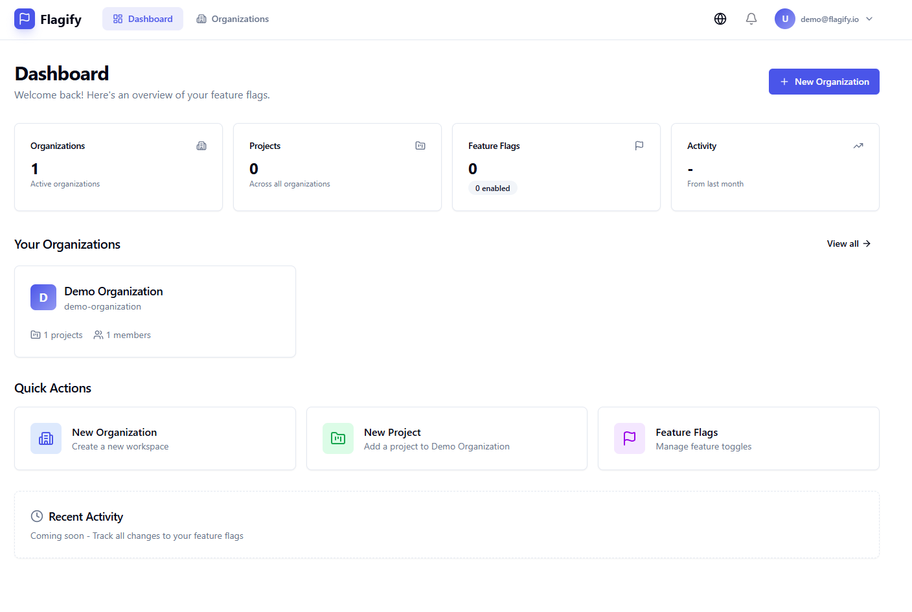

# 🚩 Flagify - Feature Flag Management Platform



A complete, self-hosted Feature Flag Management Platform similar to LaunchDarkly. Manage feature flags, organizations, projects, and environments with a modern web interface and a powerful API.

Visit the live demo: [flagify.examplesart.de](https://flagify.examplesart.de/)

## ✨ Features

- 🔐 **User Authentication & Authorization**
  - JWT-based authentication
  - Role-based access control (Owner, Admin, Member, Viewer)
  - Organization-based multi-tenant architecture

- 🏢 **Organizations & Projects**
  - Multiple organizations per user
  - Projects within organizations
  - Team management with invitations

- 🌍 **Environments**
  - Development, Staging, Production
  - Independent flag states per environment

- 🚦 **Feature Flags**
  - Multiple types: Boolean, String, Number, JSON
  - Targeting rules with conditions
  - Real-time updates

- 📊 **Audit Logs**
  - Traceability of all changes
  - Filtering by user, project, entity

- 🔑 **API Keys**
  - Server, Client, and SDK Keys
  - Expiration dates and revocation

- 🚀 **SDKs for Various Languages**
  - Official JavaScript/TypeScript SDK
  - Easy integration into applications

## 🚀 Quick Start

### Prerequisites

- Docker 20.10+
- Docker Compose 2.0+

### Installation

1. **Clone or download the repository**

```bash
git clone <repository-url>
cd flagify
```

2. **Adjust configuration (optional)**

```bash
# Copy the example configuration
cp .env.example .env

# Edit the values in .env
```

3. **Start Docker Containers**

```bash
docker-compose up -d
```

4. **Access the application**

- Frontend: http://localhost:3000
- Backend API: http://localhost:4000
- API Documentation: http://localhost:4000/health

### Demo Credentials

- **Email**: `demo@flagify.io`
- **Password**: `demo1234`

## 📁 Project Structure

```
flagify/
├── backend/           # Node.js/Express Backend API
│   ├── src/
│   │   ├── controllers/   # API Controllers
│   │   ├── middleware/    # Express Middleware
│   │   ├── routes/        # API Routes
│   │   ├── services/      # Business Logic
│   │   └── utils/         # Utilities
│   └── prisma/            # Database Schema
├── frontend/          # React/TypeScript Frontend
│   └── src/
│       ├── components/    # React Components
│       ├── pages/         # Page Components
│       └── store/         # Zustand Stores
├── sdk/               # Official SDKs
│   └── javascript/    # JS/TS SDK
```

## 📄 License

This project is open-source and available under the [MIT License](LICENSE).
├── sdk/               # Client SDKs
│   └── javascript/        # JavaScript/TypeScript SDK
└── docker-compose.yml # Docker Compose Konfiguration
```

## 🔧 Entwicklung

### Backend

```bash
cd backend
npm install
npm run dev
```

Umgebungsvariablen:
- `DATABASE_URL` - MongoDB Verbindungs-URL
- `REDIS_URL` - Redis Verbindungs-URL
- `JWT_SECRET` - Geheimer Schlüssel für JWT
- `PORT` - API Port (default: 4000)

### Frontend

```bash
cd frontend
npm install
npm run dev
```

### Datenbank-Migrationen

```bash
cd backend
npx prisma migrate dev
npx prisma db seed
```

## 📡 API Endpunkte

### Authentifizierung

| Methode | Endpunkt | Beschreibung |
|---------|----------|--------------|
| POST | `/api/auth/register` | Benutzer registrieren |
| POST | `/api/auth/login` | Einloggen |
| GET | `/api/auth/me` | Aktueller Benutzer |

### Organisationen

| Methode | Endpunkt | Beschreibung |
|---------|----------|--------------|
| GET | `/api/organizations` | Alle Organisationen |
| POST | `/api/organizations` | Organisation erstellen |
| GET | `/api/organizations/:id` | Organisation Details |
| GET | `/api/organizations/:id/members` | Mitglieder anzeigen |

### Projekte

| Methode | Endpunkt | Beschreibung |
|---------|----------|--------------|
| GET | `/api/projects/organization/:orgId` | Projekte anzeigen |
| POST | `/api/projects/organization/:orgId` | Projekt erstellen |
| GET | `/api/projects/:id` | Projekt Details |

### Feature Flags

| Methode | Endpunkt | Beschreibung |
|---------|----------|--------------|
| GET | `/api/feature-flags/project/:projectId` | Flags anzeigen |
| POST | `/api/feature-flags/project/:projectId` | Flag erstellen |
| POST | `/api/feature-flags/:id/toggle` | Flag umschalten |
| PATCH | `/api/feature-flags/:id/value` | Wert ändern |

### SDK Endpunkte (für Client-Anwendungen)

| Methode | Endpunkt | Beschreibung |
|---------|----------|--------------|
| GET | `/sdk/flags/:environmentKey` | Alle Flags |
| GET | `/sdk/flags/:environmentKey/:flagKey` | Einzelnes Flag |
| POST | `/sdk/evaluate/:environmentKey/:flagKey` | Flag mit Kontext auswerten |

## 💻 SDK Integration

### JavaScript/TypeScript

```bash
npm install @flagify/sdk
```

```typescript
import { FlagifyClient } from '@flagify/sdk';

const client = new FlagifyClient({
  apiKey: 'your-api-key',
  environment: 'production',
  baseUrl: 'https://your-flagify-instance.com'
});

// Boolean Flag prüfen
const isEnabled = await client.isEnabled('new-feature');
if (isEnabled) {
  // Neue Funktionalität anzeigen
}

// String Wert abrufen
const message = await client.getString('welcome-message', 'Welcome!');

// Number Wert abrufen
const limit = await client.getNumber('max-items', 10);

// JSON Konfiguration abrufen
const config = await client.getJSON('app-config', {});

// Mit Kontext (für Targeting)
client.setContext({
  userId: '123',
  email: 'user@example.com',
  country: 'DE'
});
const isEnabledForUser = await client.isEnabled('beta-feature');
```

## 🏗️ Architektur

### Multi-Tenant Architektur

Flagify verwendet eine Organisation-basierte Multi-Tenant-Architektur:

```
Benutzer
  └── Organisationen (Owner, Admin, Member, Viewer)
        └── Projekte
              └── Umgebungen (Dev, Staging, Prod)
                    └── Feature Flags
                          └── Targeting Regeln
```

### Datenbank-Schema

- **MongoDB**: Dokumentenbasierte Datenbank für alle Daten
- **Redis**: Caching für SDK-Anfragen (30s TTL)

### Sicherheit

- Passwörter werden mit bcrypt gehasht
- JWT für Session-Management
- API Keys für SDK-Zugriff
- Rollenbasierte Zugriffskontrolle

## 📝 Umgebungsvariablen

| Variable | Beschreibung | Standard |
|----------|--------------|----------|
| `DATABASE_URL` | MongoDB URL | - |
| `REDIS_URL` | Redis URL | - |
| `JWT_SECRET` | JWT Secret | - |
| `PORT` | API Port | 4000 |
| `NODE_ENV` | Umgebung | development |

## 🧪 Tests

```bash
# Backend Tests
cd backend
npm test

# Frontend Tests
cd frontend
npm test
```

## 📦 Deployment

### Docker Production

```bash
# Build
docker-compose -f docker-compose.yml build

# Start
docker-compose -f docker-compose.yml up -d
```

### Manuelles Deployment

1. MongoDB und Redis installieren
2. Node.js 20+ installieren
3. Backend bauen und starten
4. Frontend bauen und servieren

## 🤝 Beitragen

Beiträge sind willkommen! Bitte folgen Sie diesen Schritten:

1. Fork erstellen
2. Feature Branch: `git checkout -b feature/AmazingFeature`
3. Änderungen committen: `git commit -m 'Add some AmazingFeature'`
4. Branch pushen: `git push origin feature/AmazingFeature`
5. Pull Request erstellen

## 📄 Lizenz

MIT License - siehe [LICENSE](LICENSE) für Details.

## 🙏 Danksagungen

- Inspiriert von LaunchDarkly
- Gebaut mit React, Node.js, MongoDB, Redis
- Icons von Heroicons
